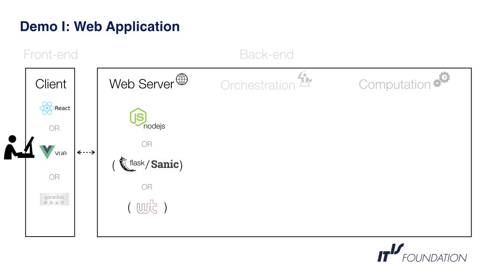
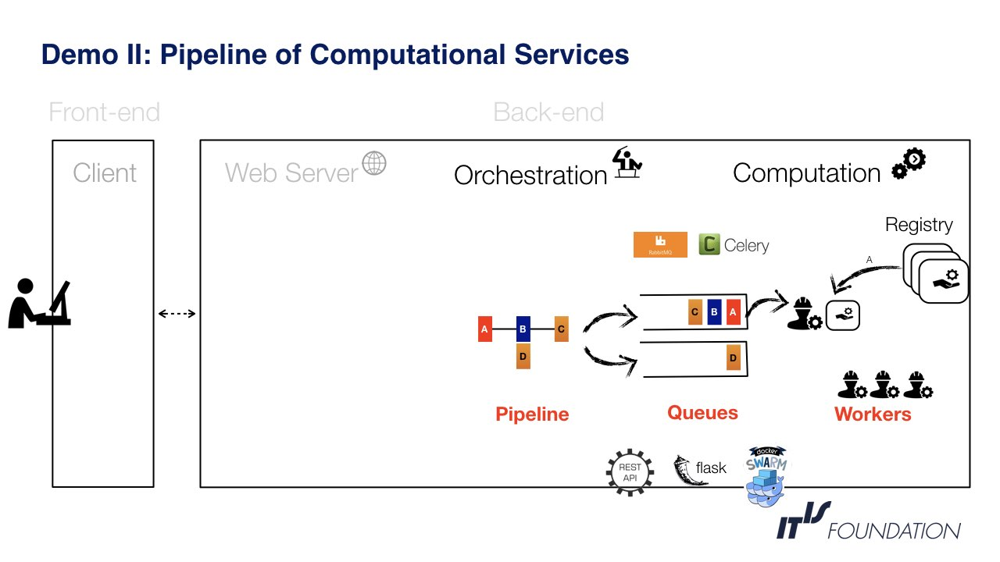

## Prototypes
All prototypes and proof-of-concepts created during the review process can be found under the [demos folder](https://github.com/ITISFoundation/osparc-lab/tree/master/demos) in the IT’IS GitHub repository. Every subfolder contains a sample program that demonstrates a technology and/or a programming concept. More details about each case is documented in place.

## Demonstrators
In order to demonstrate the different technologies in a wider context, we have designed three user stories that cover the entire platform front to back.


The first prototype demonstrates a web-application with dynamic content. The client-side implements GUIs with similar features in the three different reviewed technologies and the server-side demonstrates different frameworks to serve these apps. All three front-ends include a 3D viewer, a workbench to schedule task pipelines, a dynamic display of the settings for a given computational service (embedded in service meta-data) and several viewers for results (e.g. 2D plots, tables, etc).


This prototype demonstrates the orchestration and execution of computational services in the back-end. The demonstration starts with a pipeline of tasks that gets scheduled in a queueing system. Every task in the queue is subsequently executed by a worker service that pulls and runs the actual computational service from a docker registry. The worker is implemented as a [side-car](https://docs.microsoft.com/en-us/azure/architecture/patterns/sidecar) in order to leverage the computational service from any direct interaction with the platform.


This demonstration builds a web application that offers the entire [Sim4Life](https://www.zurichmedtech.com/sim4life/) application as a service. The user can create multiple sessions and get a full anatomical model from the Virtual Population [ViP3](https://www.itis.ethz.ch/virtual-population/virtual-population/vip3/) rendered in the browser. To achieve this, the web server communicates with the [Sim4Life](https://www.zurichmedtech.com/sim4life/) service via RPC and requests to load, process and transmit the model in chunks. When the information reaches the client-side it is rendered using  ```three.js```.


**NOTE**: These three demonstrations were presented live during the meeting with the SPARC Subject Matter Experts on December 13, 2017.

TODO Conclusions on tech review
