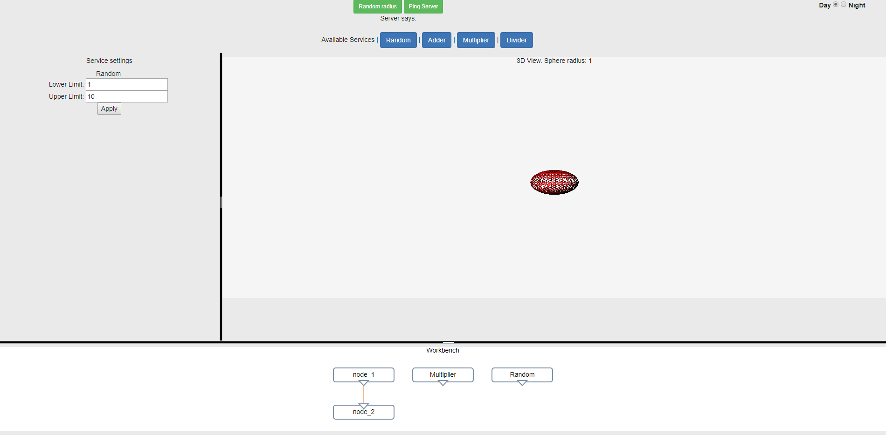
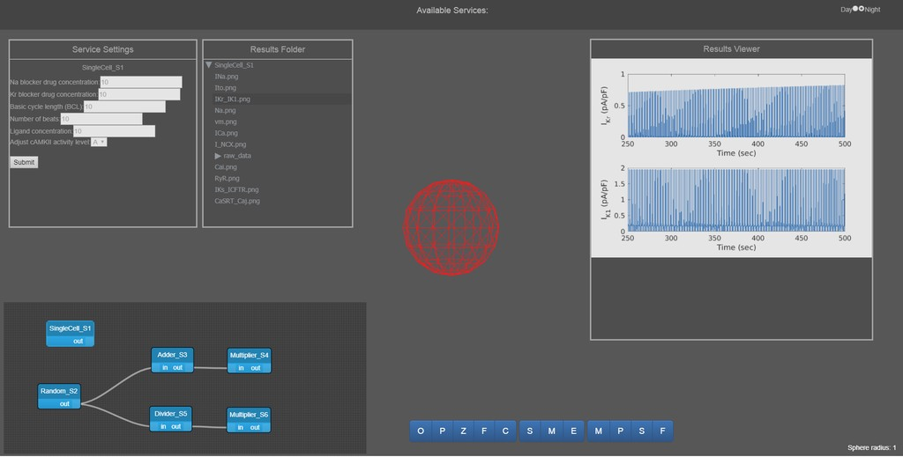
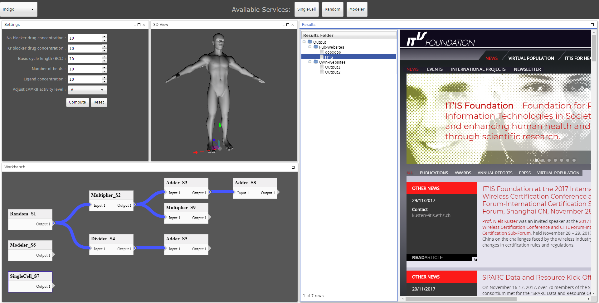

## Frameworks

The front-end part corresponds to the software running on the client
side. The server-side transmits the program/instructions to the web-
browser on the client-side, which interprets and executes them. The
front-end interacts directly with the user and for that reason one of
main features of front-end frameworks is the Graphical User Interface
(GUI). Among the wide variety of frameworks that support the development
of front-ends we pre-selected: [vue], [react] and [qooxdoo].

In order to compare advantages and disadvantages of the different
frameworks, prototype Single-Page-Applications were built for each
framework with similar User Interfaces and features.

The following components/aspects were reviewed:

- **Interactive layout**: The layout consists of at least 4 main
components: Available services, Settings viewer, 3D renderer and
Workbench. The user should be able to interact with the sizing/position
of those components. A Results viewer was also implemented for the React
and [qooxdoo] prototypes.
- **3D renderer**: The 3D viewer shows an interactive object. [three.js],
the most popular JavaScript library that uses [WebGL], was used for all
four prototypes.
- **Workbench**: The workbench shows how the different computational
services are connected to form a pipeline.
- **Data binding in UI**: All the information used in the frontend is
contained in a JSON object. This data needs to be converted to something
meaningful for the user so that the complexity behind it turns into
buttons, text/number inputs...
- **Dynamic styling**: By clicking a checkbox or dropdown menu, the GUI
style should be switchable.
- **Front-end/Back-end communication**: Some logic is implemented on the
client-side, but the heaviest logic stays on the server side. Thus, the
client needs to communicate with the server. E.g., when the web
application is started, it needs to ask the server what are the available
services. For vue, [react] and [qooxdoo] , the web socket socket.io module was
used.

### [vue]

- **Interactive layout**
    - Not very fancy packages found for creating dynamic layouts
    - Many [vue] dedicated layouts not in a mature status
    - Better to use HTML-CSS basic solutions
    - vue-splitpane module used
- **3D renderer**
    - [three.js] library used
    - Flexible and easy to use
- **Workbench**
    - Very poor resources found to build flowcharts
    - vue-port-graph module used
- **Data binding in UI**
    - The declarative UI makes it easy to mix HTML code with JavaScript
based logic coding
    - Built-in event bus (publish-subscribe) pattern communication
    - Very flexible and easy to use notification system
- **Dynamic styling**
    - Easy to define styles shared between components
- **Front-end/Back-end communication**
    - vue-socket.io module used for communication
    - Easy to set up in both server and client sides
    - Publish-subscribe pattern communication
- **Extra impressions**
    - Kind of a mixture of React.js and Angular.js
    - Templating, scripting and styling well separated
    - Lot of templating logic goes into html side code
    - Lightweight framework that needs extra third party packages/modules
to build components
    - It is growing rapidly, regularly introducing cool new features
    - Very active community behind
    - Easy learning curve

### [react]

- **Interactive layout**
    - Many packages provide very good looking interactive layouts
    - react-rnd module used
- **3D renderer**
    - react-three and react-three-renderer are the modules that go on top
of [three.js]
    - react-three-renderer (not all [three.js] features are implemented in
this wrapper)
- **Workbench**
    - Very nice packages found to represent a flowchart
    - nodes and links can be extended to fit our needs
    - storm-react-diagrams module used
- **Data binding in UI**
    - redux is the most popular module for component communication
    - Based on a store, actions and reducers: mutates the states of the
components providing interactivity
- **Dynamic styling**
    - Easy to define styles shared between components
- **Front-end/Back-end communication**
    - socket.io-client together with socket.io modules used for
communication
    - Easy to set up in both server and client sides
    - Publish-subscribe pattern communication
- **Extra impressions**
    - HTML, scripting and styling well separated
    - Not easy to mix scripting with templating
    - Lot of third party packages to choose to implement new features
    - Very active community behind and many examples already in place
    - Linear learning curve

### [qooxdoo]

- **Interactive layout**
    - qx.ui.window.Window used to make it look like a Desktop application
- **3D renderer**
    - Using [three.js] directly
    - [three.js] related OrbitControls.js and ShaderSkin.js were also used
for controlling the camera and adding texture to the head model
respectively
- **Workbench**
    - jquery-flowchart.js used
    - nodes and links can be extended to fit our needs
- **Data binding in UI**
    - 'json object' -> 'model' [qooxdoo] built-in conversion used
    - Similar to redux
- **Dynamic styling**
    - Includes different themes that can be extended/customized
    - Well separated from the logic, even though can be part of it
- **Front-end/Back-end communication**
    - socket.io module used
- **Extra impressions**
    - [qooxdoo] does not have a package manager (yet). Therefore, all 3rd
party libraries used need to be manually integrated. This has pros and
cons, e.g. an advantage is that dependencies are more under control.
    - Since the community is smaller, fewer pre-built wrappers
(integration of 3rd party packages) are available.
    - On the other hand, [qooxdoo] users typically need fewer 3rd parties,
because it tries to be a complete UI framework, much like Qt in the C++
world.
    - [qooxdoo] comes with conventions and a framework, making Javascript
more like object-oriented languages (like C++), supporting well-
structured code and lending itself to large web-based applications.

## Conclusions

This is a comparative table with the pre-selected frameworks and some
key-points

|                | [vue]          | [react]        |      [qooxdoo] |
|----------------|--------------|--------------|--------------|
|  **License**   | MIT licensed | MIT licensed | MIT licensed |
| **Popularity** | <ul><li>Released in 2014</li><li>75000 stars in Github</li><li>12000 questions in Stack overflow</li></ul> | <ul><li>Released in 2013</li><li>83000 stars in Github</li><li>65000 questions in Stack overflow</li></ul> | <ul><li>Released in 2009</li><li>600 stars in Github</li><li>1000 questions in Stack overflow</li></ul> |
|    **Pros**    | <ul><li>Mix between Angular and React</li><li>HTML, CSS and logic nicely separated</li></ul> | <ul><li>Facebook supports it. One of the most popular Front-End JavaScript framework</li><li>Lot of dedicated and easy to install 3rd party libraries | <ul><li>Desktop-like web application</li><li>Object Oriented programming model</li><li>Lots of native 3rd party libraries available</li><li>[three.js] used directly</li><li>Complete control over dependencies |
|    **Cons**    | <ul><li>No specific company supporting it</li><li>Not many dedicated 3rd party libraries available</li><li>Lack of control over dependencies</li></ul> | <ul><li>HTML, CSS and logic not very well separated</li><li>Lack of control over dependencies</li></ul> | <ul><li>Not a big community behind</li><li>Some 3rd party libraries do not integrate very well</li></ul> |

The main difference between [vue], [react] and [qooxdoo] is that the first two
provide very light frameworks and programming concepts with simple
skeletons to start building on top of, while [qooxdoo] provides a mature
framework with a collection of UI widgets. That means that for [vue] and
[react] one needs to look for all the UI components that one may want to
add and subsequently needs to install them, using the Node Package
Manager, together with their dependencies. In [qooxdoo] , instead, if the
original framework doesn't provide the component, you need to download
the desired package and keep it within the project.

Based on our review we found that, taking into account that it is easier to build
desktop-like applications and the native Object Oriented programming model, [qooxdoo]
is the most suitable framework to implement SIM-CORE's front-end.

[react]: https://reactjs.org
[three.js]: https://threejs.org/
[qooxdoo]: http://www.qooxdoo.org
[vue]: https://vuejs.org
[WebGL]: https://www.khronos.org/webgl/
