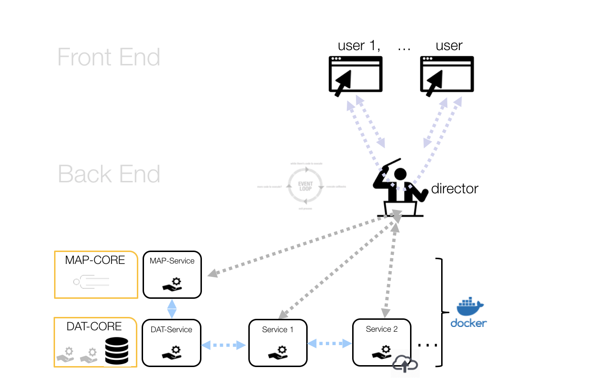

## Design Concepts

SIM-CORE is designed as a web simulation platform that will allow users
to perform complex numerical simulations combining computational services
developed by the scientific community. It shall work in coordination with
its sibling platforms MAP and DAT-COREs that will host scientific models,
data and services built, shared and validated by the community.

### User Story
In order to help understanding the context and functionality intended for the framework,
a standard workflow expected from a SIM-CORE user is sketched in the following figure:

The user access SIM-CORE platform using a web interface. The platform
provides access to a curated repository of scientific models and data stored in MAP
and DAT-COREs. Using SIM-CORE, the user can create a new workflow by interconnecting
each model or dataset. Each of these building blocks are treated as isolated services
that are orchestrated and executed by the framework. The entire execution process is
monitored and the chain of custody preserved. If the user decides to share this
new model or results with the scientific community, the framework shall enable
this giving access to MAP and DAT-CORE services.

### Architecture

The framework architecture is divided in four major building blocks. The client-side
entirely fills the front-end while the back-end is subdivided into the
web server, the orchestration and the computational modules. This subdivision is
used as a base to organize the review of available technologies needed to
build a reliable and sustainable framework.

### Workflow

This is an schematic view of the framework in action. The system is based on the orchestration
of contained services that can perform computations or access/interaction to other CORES.

Users obtain information about available and applicable services via the web server, who queries each service’s properties (what does it do, what does it require, latency…) stored in MAP/DAT-CORE.
The user configures what and how to use these services by creating a work-flow (pipeline) with them in the UI. Services are packaged as container images, which become standard de facto units for development, shipment, and deployment of software tools.

The users schedules some pipelines to run using the web interface. The framework,
at the back-end, coordinates a number of running services, including those with access
to MAP and DAT-COREs. The orchestration module is responsible for scheduling, scaling, monitoring,
and running services. Services are the execution units offered by the framework. Available services are
stored in DAT-CORE.
