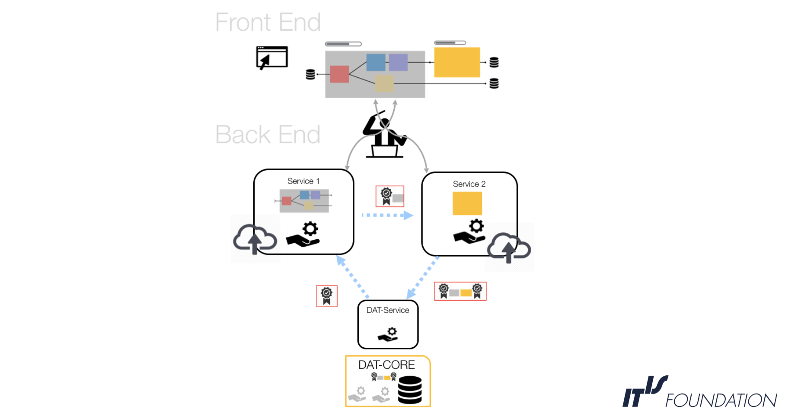
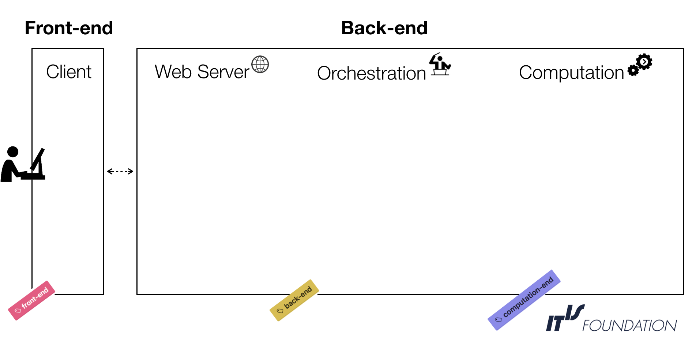

## Design Concepts

SIM-CORE is designed as a web platform that will allow users
to perform complex numerical simulations that combine computational services (services are 
the execution units offered by the framework and are
stored in the DAT-CORE)
developed by the scientific community. It shall work in close coordination with
the MAP- and DAT-CORE platforms that will host scientific models,
data and services which have been generated, shared, and validated by the community.

### User Story
In order to help understanding the context and intended functionality of the framework,
a standard workflow expected by a SIM-CORE user is sketched in the following figure:

The user accesses the SIM-CORE platform using a web interface. The platform
provides access to a curated repository of scientific models and data stored in the MAP-
and/or DAT-COREs. Using the SIM-CORE, the user can create a new workflow ('study'), for 
example by connecting
models and/or dataset. All those building blocks are treated as isolated services
that are orchestrated and executed by the back-end of the framework, which also 
standardizes and handles communication between services. The entire execution process is
monitored and the chain of custody is preserved (by routing all data and services through 
the DAT-CORE). If the user decides to share this
new, combined model/workflow or its results with the scientific community, the framework 
shall enable
this, for example through storing them in the DAT-CORE database.

### Architecture

The framework architecture is divided into four major building blocks. The front-end entirely 
consists of the client-side component (user interface), while the back-end is subdivided into 
the web-server (coordinating the front-end with back-end process), the orchestration 
(service management), and the computational (actual services) modules. This subdivision is
reflected in the review of available technologies needed to
build a reliable and sustainable framework.

### Workflow

This is a schematic view of the framework in action. The system is based on the 
orchestration
of containerized services that can perform computations or interact with/access other 
COREs.

Users obtain information about available and applicable services via the web server, which 
queries each service's properties (what does it do, what does it require, latency, etc.) from 
the DAT-CORE.
In the UI, the user configures how to employ/involve/connect these services by creating a 
workflow (pipeline). Services are packaged as container images, which have become popular 
standard units for the development, shipment, and deployment of software tools.

The user schedules (using the web interface) some pipelines for execution. At the back-end, 
the framework coordinates the required services (running or newly started), including 
services with access
to the MAP- and DAT-COREs. The orchestration module is responsible for scheduling, 
communication, scaling, monitoring,
and running the services. 

